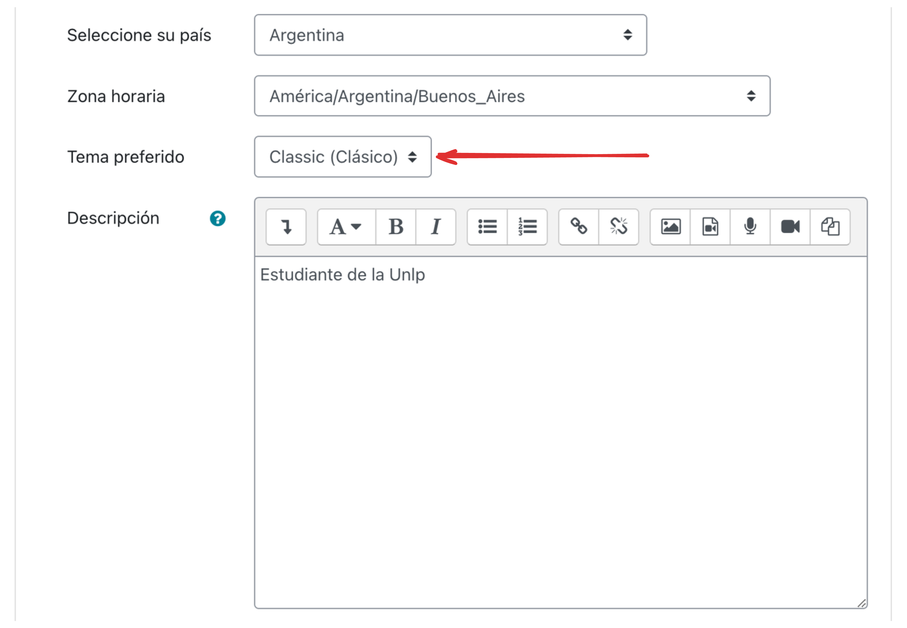
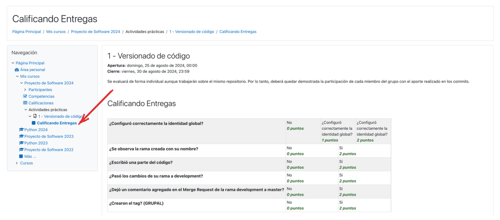

# Visualización de Rúbricas

Durante la cursada, deberán realizar diversas actividades. Para algunas de estas actividades en Moodle, es posible que definamos una rúbrica con los criterios específicos de evaluación. Esta rúbrica estará disponible para que puedan consultarla y así saber en qué aspectos deben enfocarse para completar correctamente la tarea.

<!-- more -->

Para visualizar correctamente las rúbricas en nuestro portal de cátedras, es fundamental que utilicen un "Tema" particular. **Si no lo tienen configurado, no podrán ver las rúbricas.**

Para configurarlo, deben acceder a su perfil en el portal de cátedras y seleccionar el tema "Classic" como "Tema predefinido".

Con este tema, deberían poder acceder al enlace correspondiente para ver la rúbrica de cada tarea. Primero, entren a la tarea en cuestión y hagan clic en el enlace que aparece debajo del título en el menú de la izquierda:

Una vez que hagan clic, deberían poder ver, como se muestra en la imagen anterior, una tabla con la rúbrica de la tarea.