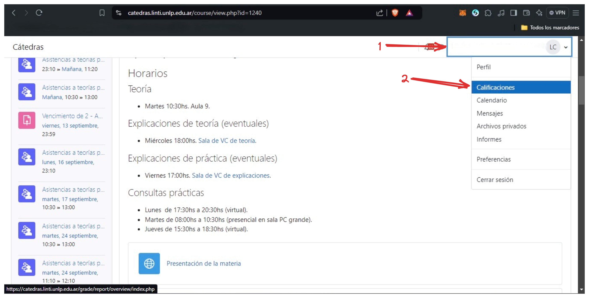
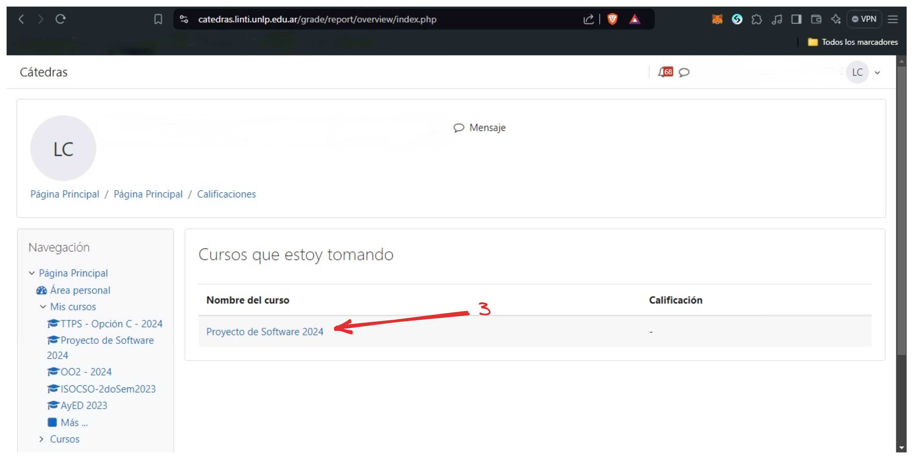
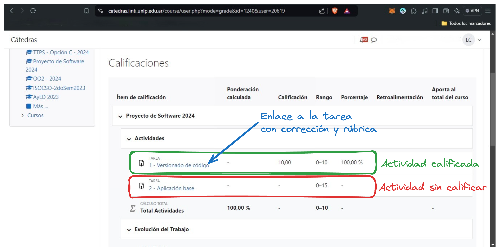

# Calificaciones

En esta guía vamos a explicar como pueden ver en moodle sus calificaciones. Deben tener en cuenta que sólo tendrán acceso a las calificaciones propias, no a las de sus compañeros. Por este motivo si no ingresan de la forma adecuada podrán aparecer errores.

<!-- more -->

# Pasos a seguir

Logueados en la plataforma de Moodle, deberán seguir los siguientes pasos:

1. Hacer click en el menú superior derecho en su nombre de usuario.
2. Seleccionar la opción "Calificaciones".

3. Esto les mostrará un listado con los cursos de los cuales pueden visualizar las calificaciones. Deberán seleccionar Proyecto de Software.

4. Una vez seleccionado el curso, podrán ver las calificaciones de las actividades que hayan realizado.

Recomendamos que tengan el tema "Classic" seleccionado en su perfil para visualizar correctamente las calificaciones. Los otros temas pueden ser algo confusos a la hora de visualizar las calificaciones y rúbricas.