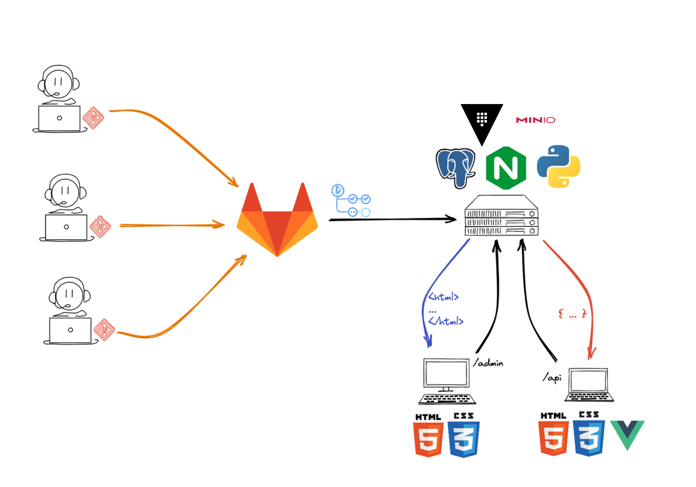

# Infraestructura del servidor la cátedra

En esta sección se describe la infraestructura de servidores que se utilizará para el
desarrollo del proyecto de la materia. Aquí se detallan las tecnologías y herramientas
que se utilizarán, así como los accesos y recursos disponibles para los estudiantes.

## Gráfico de la infraestructura

## Versiones a utilizar

- Lenguaje: <strong>Python 3.12.3</strong>.
- Dependencias Python: <strong>Poetry (2.1.4)</strong>.
- Servidor Web: <strong>nginx/1.24.0 (Ubuntu)</strong>.

## Código en el server para cada grupo

<label for="number">
  <strong>Número</strong>

  <input type="number" min=0 step=1 value=0 class="md-input link" id="number" pattern="[0-9]+">
</label>

[:material-link: Admin - Grupo #00](https://admin-grupo00.proyecto2025.linti.unlp.edu.ar/){ .md-button .md-button--primary .link #admin-link }

[:material-link: Portal - Grupo #00](https://grupo00.proyecto2025.linti.unlp.edu.ar/){ .md-button .md-button--primary .link #portal-link }

## Logs

!!! Info
    Pronto se publicarán los enlaces para poder visualizar los logs.

## Base de datos

!!! Info
    Aquí publicaremos la dirección para acceder a la base de datos de cada grupo.

## Almacenamiento de objetos

!!! Info
    Pronto se publicarán los enlaces para poder acceder al almacenamiento de objetos (MINIO).

## Variables de entorno

!!! Info
    Pronto se publicarán las variables de entorno que se deben configurar en el servidor (Vault).
